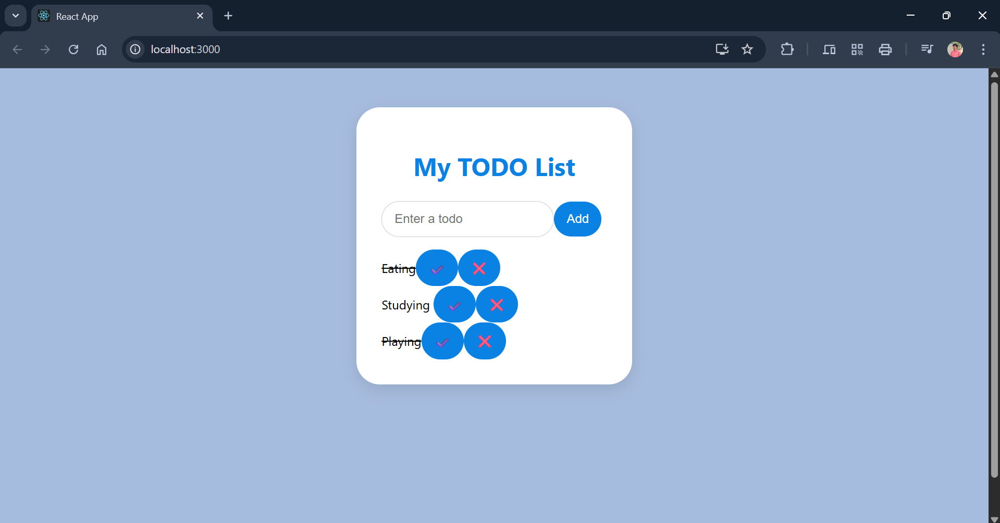

---

## **PROGRAM 13 – React TODO App**

---

### **AIM**

To develop a TODO list application frontend using **React**, allowing users to **add**, **complete**, and **delete** tasks with a clean, **Canva-style UI**.

---

### **DESCRIPTION**

This experiment demonstrates how to build a **single-page TODO application** using **React.js**. The app allows users to manage their daily tasks interactively. It introduces essential React concepts including:

* `useState` for state management
* **Component-based architecture**
* **Form handling**
* **Conditional rendering**
* Basic **CSS styling** for a modern UI

This project is excellent for beginners to practice **React fundamentals** and frontend interactivity.

---

### **PROJECT STRUCTURE**

```
todo-app/
│
├── public/
│   └── index.html               # HTML template
│
├── src/
│   ├── components/
│   │   ├── TodoForm.js          # Form component to add tasks
│   │   ├── TodoItem.js          # Renders a single task
│   │   └── TodoList.js          # Lists all tasks
│   ├── App.js                   # Main application logic
│   ├── App.css                  # Canvas-style CSS design
│   └── index.js                 # Entry point of the React app
│
├── package.json                 # Project metadata and dependencies
└── README.md                    # Documentation
```

---

### **Output**



---

### **INSTALLATION & SETUP**

#### **PREREQUISITES**

* Node.js & npm
* VS Code or any preferred editor
* Basic React knowledge

---

#### **STEPS TO RUN THE PROJECT**

1. **Create React App**

```bash
npx create-react-app todo-app
cd todo-app
```

2. **Create Components**
   Inside `src/components/`, add:

* `TodoForm.js` – for input and task submission
* `TodoItem.js` – to display individual tasks
* `TodoList.js` – to list and manage all tasks

3. **Add Logic in App.js**

* Use `useState` to manage task data
* Implement functions to **add**, **toggle complete**, and **remove** tasks
* Pass necessary props to child components

4. **Style the App**
   Use `App.css` to implement a **modern Canva-style layout** (e.g., cards, soft shadows, rounded corners).

5. **Run the Project**

```bash
npm start
```

6. **Visit in Browser**
   Open your browser at:

```
http://localhost:3000
```

---

### **LICENSE**

This project is **open-source** and free to use.

---

### **Author**

• **K Sravanthi**

• GitHub: [https://github.com/sravanthikhatha](https://github.com/sravanthikhatha)

---
