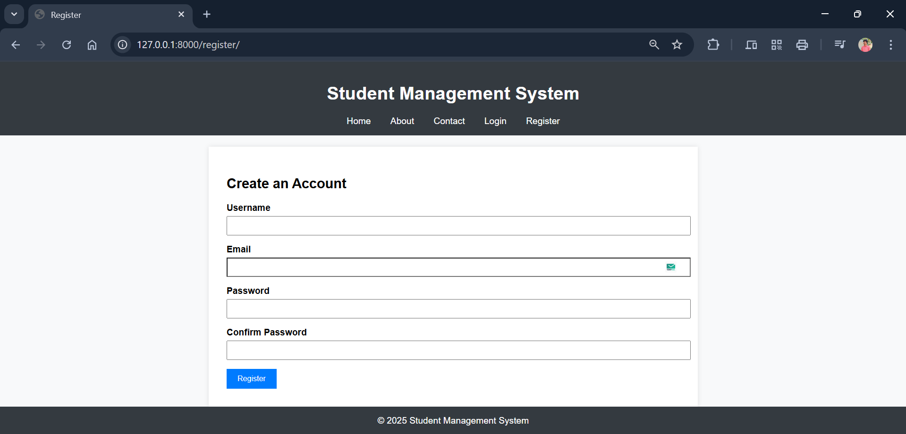
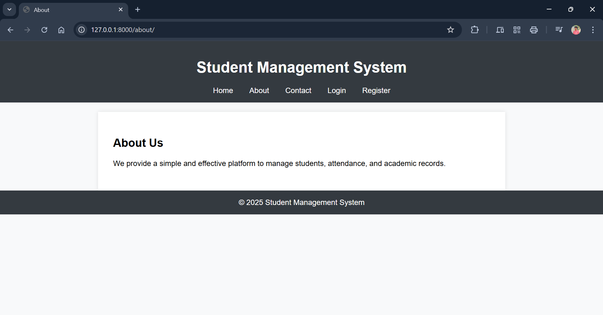
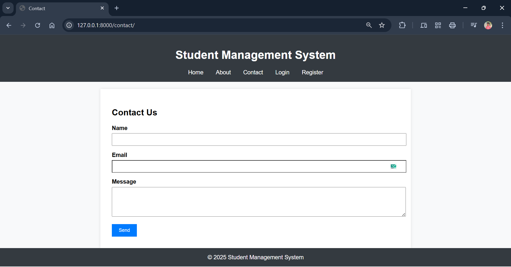

---

## **PROGRAM 14 – Django Student Management**

---

### **AIM**

To develop a **student management system backend** using Django, enabling users to **register**, **log in**, and access basic student information through a clean, **Canvas-style UI**.

---

### **DESCRIPTION**

This experiment demonstrates how to build a basic Django web application with user authentication and navigation between pages like **Home**, **About**, and **Contact**. It introduces key Django concepts such as:

* **URL routing**
* **Views and templates**
* **Static file management**
* **Form handling and authentication**

The project is ideal for beginners exploring Django's **MVT (Model-View-Template)** architecture.

---

### **PROJECT STRUCTURE**

```
student_mgmt/
├── core/                    # Application logic
│   ├── views.py            # View functions for all routes
│   └── urls.py             # URL patterns specific to the app
│
├── templates/              # HTML templates for rendering UI
│   ├── base.html           # Common layout (header/footer)
│   ├── home.html           # Home page
│   ├── about.html          # About page
│   ├── contact.html        # Contact page
│   ├── login.html          # User login
│   └── register.html       # User registration
│
├── student_mgmt/           # Main project settings
│   ├── settings.py         # Project configuration
│   └── urls.py             # Project-level URL routing
│
├── db.sqlite3              # SQLite database
├── manage.py               # Django CLI utility
└── README.md               # Documentation
```

---

### **Output**

Home page:


Login page:


Registration page:


About Us page:


Contact Us page:


---

### **INSTALLATION & SETUP**

#### **PREREQUISITES**

* Python 3.x
* Django 5.2
* VS Code or any preferred editor
* Basic knowledge of Django

---

#### **STEPS TO RUN THE PROJECT**

1. **Clone the Repository or Create Project**

```bash
git clone <repository-url>
cd student_mgmt
```

2. **(Optional) Create and Activate Virtual Environment**

```bash
python -m venv venv
# Activate environment:
source venv/bin/activate   # For macOS/Linux
venv\Scripts\activate      # For Windows
```

3. **Install Django**

```bash
pip install django==5.2
```

4. **Apply Migrations**

```bash
python manage.py migrate
```

5. **Create Superuser (Optional - for Admin Panel)**

```bash
python manage.py createsuperuser
```

6. **Run the Development Server**

```bash
python manage.py runserver
```

7. **Access the App in Browser**
   Visit:

```
http://127.0.0.1:8000/
```

---

### **FEATURES**

* User registration and login
* Navigation between static pages
* Canvas-style UI with shared layout
* Easy-to-understand Django architecture

---

### **LICENSE**

This project is **open-source** and free to use.

---

### **Author**

**K Sravanthi**

GitHub: [https://github.com/sravanthikhatha](https://github.com/sravanthikhatha)

---
